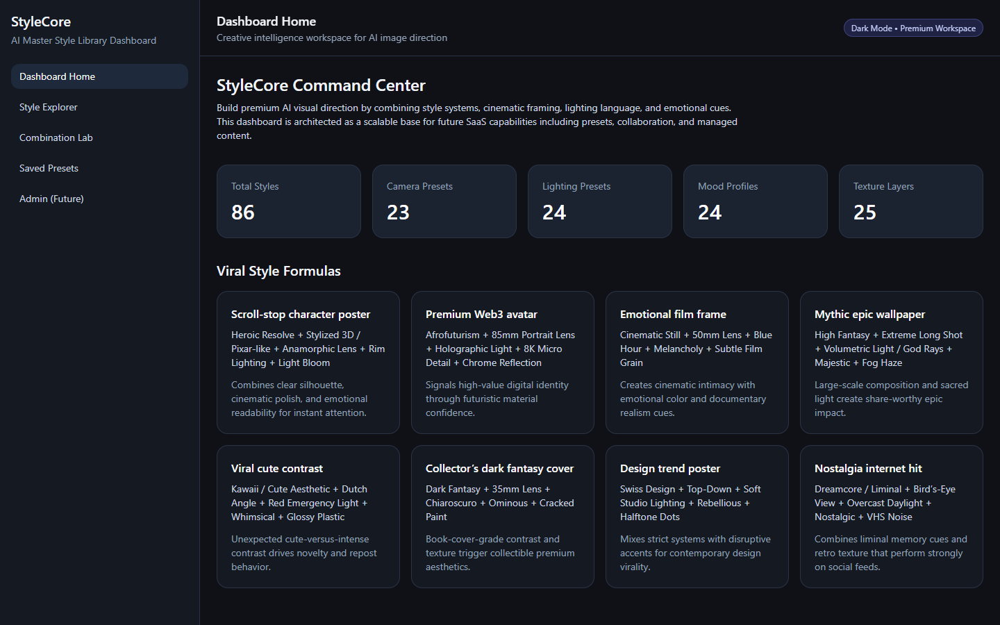
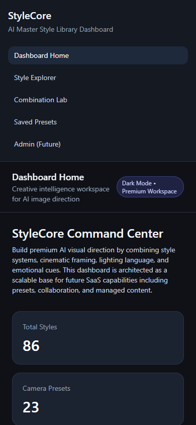

# StyleCore AI Style Library

Modular AI style-library dashboard for exploring visual aesthetics, combining creative controls, and generating structured image prompts.

## Product Focus

StyleCore is designed for prompt engineers, designers, and creative teams that need a reusable library of visual styles, camera language, lighting references, mood systems, textures, and viral prompt formulas.

## Preview



Mobile smoke check:



## Core Features

- Dashboard overview with style-library signals
- Style explorer with category filters
- Style cards and substyle metadata
- Combination lab for subject, style, camera, lighting, mood, and texture controls
- Deterministic prompt builder utilities
- Lightweight scoring helpers
- JSON export utility
- Modular data files for future CMS/API migration

## Tech Stack

- React 18
- Vite
- Tailwind CSS
- ESLint
- Modular JavaScript data and utility layers

## Architecture

- `src/app`: application composition
- `src/components/layout`: app shell, sidebar, and topbar
- `src/components/pages`: dashboard, explorer, and combination lab pages
- `src/components/shared`: reusable UI primitives
- `src/data`: style, camera, lighting, mood, texture, and formula datasets
- `src/hooks`: prompt builder and style filter state
- `src/utils`: prompt generation, scoring, filtering, export, and dashboard helpers

## Run Locally

```bash
npm install
npm run dev
```

## Useful Commands

```bash
npm run lint
npm run build
npm run preview
```

## Current Status

This repository is a standalone extraction candidate from the previous `Bro` workspace. It has a clear product direction and modular frontend structure, but dependency installation, lint, build, and browser smoke testing still need to be completed before public promotion.

See `docs/REPOSITORY_STATUS.md` for the validation checklist.

## Roadmap

- Add persistence for saved prompt recipes and favorite style combinations
- Add import/export presets for team workflows
- Add image provider integration layer
- Add style taxonomy editor for admin-managed content
- Add search, sort, and comparison tools for large style libraries
- Add tests around prompt builder and filtering utilities
